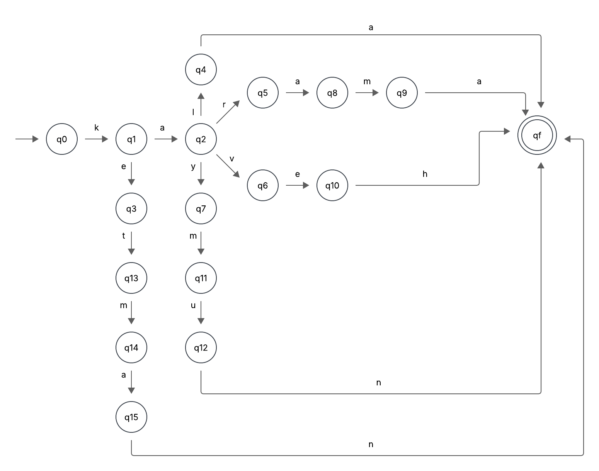

# A01707279_Evidence1_TC2037
### Lorain Valeria Gonzalez Rivas, A01707279

# Evidence 1
## Implementation of Lexical Analysis (Automaton and Regular Expression)

# Description
## Chakobsa language - The chosen one
The chosen language for this first evidence is the "Chakobsa language" which is a fictional language created by the famous science fiction writer called Franklin Patrick Herbert Jr., better known as Frank Herbert, for his famous 1965 novel "Dune", and its five sequels. This language is mainly related to the Fremen society, who were the desert-dwelling people of the planet Arrakis. Chakobsa is not only a way of expressing or communicating between individuals, this fictional language is also very valuable beacuse of its reflection of the culture and the environment of its speakers, emphasizing their connection to the harsh desert landscape. 
#### Key Vocabulary in Chakobsa
For this evidence, will be taken into account just a few words that are derived from this Chakobsa language. The words to be used are:
- **Kala:** This word can be translated to *"desert"* and it encloses the vast and arid landscapes that the Fremen describe as home on Arrakis.
- **Karama:** This term means *"miracle"* and is borrowed from the Ishkal language, highlighting the cultural connections in Herbert's universe.
- **Kaveh:** This word refers to *"coffee"* an essential beverage that signifies the importance of trade and sustenance in the Fremen way of life.
- **Kaymun:** This term denotes *"sand finely ground sand like powder"*, this highlights the unique environmental conditions of Arrakis, where such fine sand predominates.
- **Ketman:** This concept represents *"the practice of concealing the identity when revealing it might be harmful"*, especially when revealing it could pose a danger, reflecting the Fremen's instinct for survival in a hostile world.
These words associated to the narrative of *Dune* do more than just tell a story, these words can also give us a glimpse into the values and experiences of the Fremen people. This really shows how language can both shape and mirror a culture.
## Automata
When we talk about finite automata, is known that it is a theoretical model or an abstract machine used in computer science in order to recognize patterns within input sequences. This was the responsible of generating the basis for understanding regular languages in computer science. On the other hand, finite automata is formed by states, transitions, and input symbols, which work collaboratively to process sequences and figure out if they belong to a particular language.
The following symbols [K, Σ, q0, F, δ] are used to define Automata in a formal way:
- **K:** Represents the number of states un automaton.
- **q0:** Represents the initial state of the automaton.
- **F:** Refers to the final state of the automaton.
- **δ:** It is used to represent the transitions in the automaton. 
- **Σ:** Refers to the finite alphabet.
Continuing with relevant information about the finite automaton, there are two different types of automata:
1. **Deterministic Finite Automata *(DFA)*:** For each state and input symbol, there is only one possible transition to another state.
2. **Non-deterministic Finite Automata *(NFA)*:** Allows multiple transitions for the same input symbol and accepts empty transitions.
The main differences between these two types of finite automata is that in DFA the only move to make is to a specific state with a letter (think about k and that it can only take you from q0 to q1), whereas with NFA there's planty of possible moves you can take, since it can move to more than one state using one letter (think about k and it could take you from q0 to q1 or q0 to q2 or q0 back to q0). Just to conclude this informative section about automata, it is relevant to mention that the NFA will take null values as inputs.
+ In order to make things clear, this project will be made with a *DFA* perspective because there is only one unique way or road to take in order to achieve the correct formation of the alphabet's letters to produce the desired words.

# Models
## Automaton model - The chosen one
I generated a single automata that is valid for the five words of the language. It is important to mention that this automaton only accepts the following finite alphabet:
**Σ =** {a, e, h, k, l, m, n, r, t, u, v, y, -}
Any other letter, symbol or character that is not included in the finite alphabet or in the automaton transitions will not be accepted. 
*The following diagram represents the automaton I designed for this first evidence:*

The automaton that I generated allowed us to recognize each given word individually. Including the fact that the actual automaton was not generated to accept sequences where one word is followed by another, so it only generates the words ["kala", "karama", "kaveh", "kaymun", "ketman"].
## Regular expression
When we talk about "Regular expressions" or 'regex', these are patterns used to match character combinations in strings. Regular expressions are composed of simple characters or a combination of simple and special characters such as '/abc/', '/ab*c/' or '/Chapter (\d+)\.\d*/'. In some cases, these patterns includes parentheses, which means that it is used as a memory device and a part of the pattern is remembered for later use. 
To represent in another way the generated automaton, we can represent it in a regular expression form. In this case, as I mentioned previously in the automaton model, I will use only the letters included in the finite alphabet and the same criteria for accepting or rejecting a string. 
*The regular expression or 'regex' generated for this evidence is the following one:*
(^k)((ala) | (arama) | (aveh) | (aymun) | (etman))
### Regular expression breakdown
- **(^k):** The string must initiate with the letter 'k'.
    - **((ala) | (arama) | (aveh) | (aymun) | (etman)):** After the letter 'k', there are two possible paths to follow, which are the following:
    - *If after the letter 'k' continues a letter 'a', you should take any of the following roads:*
        - *ala:* Only used if after the "ka" comes a letter 'l'. In that case, the word must be finished with an 'a', forming the word *'kala'*.
        - *arama:* Only used if after the "ka" comes a 'r'. In that case, the word must be finished with the letters ['a', 'm', 'a'], forming the word *"karama"*.
        - *aveh:* Only used if after the "ka" comes a letter 'v'. In that case, the word must be finished with the letters ['e', 'h'], forming the word *"aveh"*.
        - *aymun:* Only used if after the "ka" comes a 'y'. In that case, the word must be finished with the letters ['m', 'u', 'n'], forming the word *"aymun"*.
    - *While, if after the letter "k" comes a letter 'e', there's only one way to proceed and it is...*
        - *etman:* It only integrates the letters ['t', 'm', 'a', 'n'] after the "ke", that the program previosly saved, forming the word *"ketman"*.